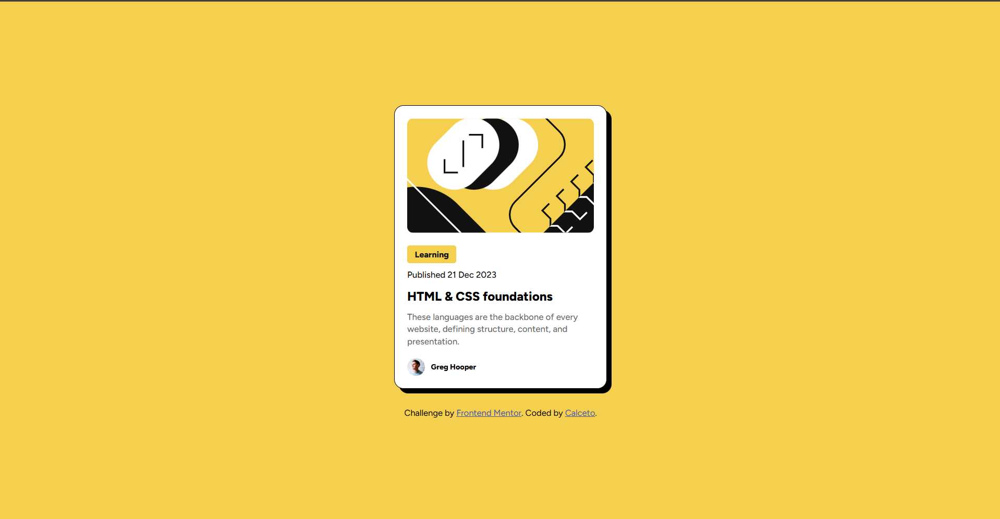

# Blog Preview Card

Solución al reto [Blog Preview Card](https://www.frontendmentor.io/challenges/blog-preview-card-ckPaj01IcS) de Frontend Mentor.

## Vista previa

## Construido con

- HTML5 semántico
- CSS personalizado
- Flexbox
- Mobile-first

## Lo que aprendí

- Cómo usar `@font-face` para hospedar fuentes localmente en lugar de Google Fonts
- Uso de fuentes variables con rango de `font-weight` en `@font-face`
- La función `clamp()` para tipografía fluida sin media queries
- El elemento `<time>` con el atributo `datetime` para fechas semánticas
- Efecto hover combinando `transform` y `box-shadow` con `transition`

## Autor

- Frontend Mentor: [@Calceto23](https://www.frontendmentor.io/profile/Calceto23)
- GitHub: [@Calceto23](https://github.com/Calceto23)